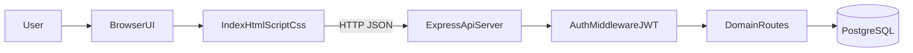
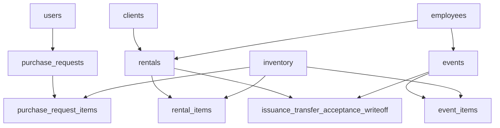

# Архитектура и потоки данных

## 1) Контекстная архитектура

## 2) Доменные сущности (ER-уровень)

## 3) Процесс от дефицита до закрытия документов

```mermaid
flowchart LR
    stockCheck[InventoryDeficitDetected]
    createDraft[CreateOrRefreshPurchaseDraft]
    approve[ApproveRequest]
    delivery[ApplyDelivery]
    issueDoc[IssueTransferDocuments]
    acceptance[AcceptanceOrReturn]
    writeoff[WriteoffIfNeeded]
    report[UpdateDashboardReports]

    stockCheck --> createDraft
    createDraft --> approve
    approve --> delivery
    delivery --> issueDoc
    issueDoc --> acceptance
    acceptance --> writeoff
    writeoff --> report
```

## 4) Технические примечания для защиты
- Backend: [d:\\ВКР\\WarehouseApp\\server.js](d:\\ВКР\\WarehouseApp\\server.js)
- Ключевые маршруты:
  - [d:\\ВКР\\WarehouseApp\\routes\\inventory.js](d:\\ВКР\\WarehouseApp\\routes\\inventory.js)
  - [d:\\ВКР\\WarehouseApp\\routes\\rentals.js](d:\\ВКР\\WarehouseApp\\routes\\rentals.js)
  - [d:\\ВКР\\WarehouseApp\\routes\\events.js](d:\\ВКР\\WarehouseApp\\routes\\events.js)
  - [d:\\ВКР\\WarehouseApp\\routes\\documents.js](d:\\ВКР\\WarehouseApp\\routes\\documents.js)
- Frontend core:
  - [d:\\ВКР\\WarehouseApp\\index.html](d:\\ВКР\\WarehouseApp\\index.html)
  - [d:\\ВКР\\WarehouseApp\\script.js](d:\\ВКР\\WarehouseApp\\script.js)
  - [d:\\ВКР\\WarehouseApp\\warehouse-advanced.js](d:\\ВКР\\WarehouseApp\\warehouse-advanced.js)
